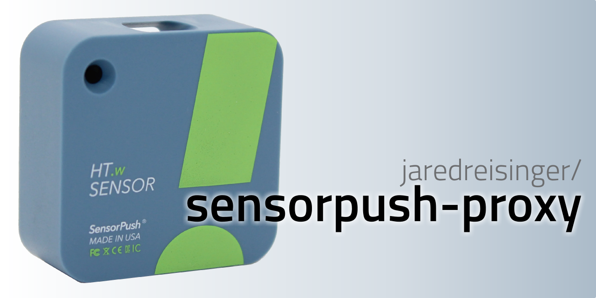

A rate-limiting, authentication-hiding proxy for [SensorPush](https://www.sensorpush.com) data.

[](https://pkg.go.dev/github.com/jaredreisinger/sensorpush-proxy)

[](https://github.com/jaredreisinger/asp/actions/workflows/build.yml)
[](https://codecov.io/gh/JaredReisinger/sensorpush-proxy)
[](https://goreportcard.com/report/github.com/jaredreisinger/sensorpush-proxy)
[](https://github.com/JaredReisinger/sensorpush-proxy/blob/main/LICENSE)


<!-- TOC -->

- [Usage](#usage)
    - [Get SensorPush credentials](#get-sensorpush-credentials)
    - [Get sensorpush-proxy](#get-sensorpush-proxy)
    - [Discover sensor IDs](#discover-sensor-ids)
    - [Figure out your desired configuration and run the proxy](#figure-out-your-desired-configuration-and-run-the-proxy)
        - [As command-line flags](#as-command-line-flags)
        - [As environment variables](#as-environment-variables)
        - [As a config file](#as-a-config-file)
    - [Call the API](#call-the-api)
- [Background](#background)

<!-- /TOC -->

## Usage

More than likely, you’ll want to use the already-built [Docker image](https://hub.docker.com/r/jaredreisinger/sensorpush-proxy) for this, so that you can just throw your credentials and sensor config at it and let it run behind something like Traefik or nginx. Regardless of whether you use Docker or the raw binary, `sensorpush-proxy` includes both the proxy itself and also a `query` sub-command to help you discover the sensor IDs available to you.

> _See [`docs/docker.md`](./docs/docker.md) for the Docker usage documentation._

### Get SensorPush credentials

If you have any SensorPush devices, you ought to already have an account with SensorPush. In order to activate API access, you need to sign into their [Gateway Cloud Dashboard](https://dashboard.sensorpush.com/) at least once and agree to the terms of service. Once you've done that, the username and password you use for that dashboard are the same ones you need for this proxy. Unfortunately, SensorPush does not allow you to create limited-use (and revocable) tokens to use in place of your password for API access. This proxy uses the password you provide _**only**_ to retrieve the sensor data you request. Use security best practices to ensure that the password configuration you pass to this proxy is kept secret/encrypted until the last possible moment.

### Get sensorpush-proxy

Grab a binary distribution for your platform from [the releases page](https://github.com/JaredReisinger/sensorpush-proxy/releases). You can also build from source, in which case you may want to take a look at the [CONTRIBUTING](./CONTRIBUTING.md) documentation for more about the tooling and expected process.

> _If you want the Docker image, see [`docs/docker.md`](./docs/docker.md)._

### Discover sensor IDs

Use the `query` subcommand with your SensorPush credentials to discover the sensor IDs available to you:

```sh
sensorpush-proxy query --username YOUR_SENSORPUSH_USERNAME --password YOUR_SENSORPUSH_PASSWORD
```

You should see as output several log lines that show the name, ID, and type of the sensors on your account _(IDs shown below are not real!)_:

```
2023/01/17 15:30:24 Kitchen
2023/01/17 15:30:24   ID  : "123456.67834768348756683478"
2023/01/17 15:30:24   Type: HT1
2023/01/17 15:30:24 Humidor
2023/01/17 15:30:24   ID  : "134567.9834598734598734598"
2023/01/17 15:30:24   Type: HT1
2023/01/17 15:30:24 Garage
2023/01/17 15:30:24   ID  : "135678.0934908340980985858"
2023/01/17 15:30:24   Type: HT1
```

### Figure out your desired configuration and run the proxy

`sensorpush-proxy` supports configuration by command-line flags, by environment variables, or by configuration file; use whichever form or combination of forms is the most convenient. _**However**_, please be aware of the risk of putting your SensorPush password in plaintext in any form. The generally-accepted best practice for things like passwords is to keep them as secrets in your CI/CD pipeline or container orchestration tool, and to provide them to `sensorpush-proxy` from there. That said, the examples here won’t show any use of secrets.

Given the above example, let’s assume that we want to proxy the “Kitchen” (`123456.67834768348756683478`) and “Garage” (`135678.0934908340980985858`) sensors, using the names “inside” and “outside” respectively.

#### As command-line flags

_(Shown here across multiple lines for readability...)_

```sh
sensorpush-proxy proxy \
  --username YOUR_SENSORPUSH_USERNAME --password YOUR_SENSORPUSH_PASSWORD \
  --sensors inside=123456.67834768348756683478,outside=135678.0934908340980985858
```

#### As environment variables

```sh
export SPP_SENSORPUSH_USERNAME=YOUR_SENSORPUSH_USERNAME
export SPP_SENSORPUSH_PASSWORD=YOUR_SENSORPUSH_PASSWORD
export SPP_PROXY_SENSORS=inside=123456.67834768348756683478,outside=135678.0934908340980985858

sensorpush-proxy proxy
```

#### As a config file

_(in ./config.yaml, say)_

```yaml
sensorPush:
  username: YOUR_SENSORPUSH_USERNAME
  password: YOUR_SENSORPUSH_PASSWORD

proxy:
  sensors:
    inside: "123456.67834768348756683478"
    outside: "135678.0934908340980985858"
```

```sh
sensorpush-proxy proxy --config ./config.yaml
```

### Call the API

There is only one API endpoint exposed at present, `/sensors`, which returns a JSON object keyed by the sensor names from the configuration.  This example pipes through `jq` purely for prettier formatting:

```sh
curl http://localhost:5375/sensors | jq .
```

```json
{
  "inside": {
    "altitude": 0,
    "barometric_pressure": 0,
    "dewpoint": 0,
    "humidity": 60.8,
    "observed": "2023-01-25T21:02:55Z",
    "temperature": 64.4,
    "vpd": 0
  },
  "outside": {
    "altitude": 0,
    "barometric_pressure": 0,
    "dewpoint": 0,
    "humidity": 56.2,
    "observed": "2023-01-25T21:03:35Z",
    "temperature": 50.1,
    "vpd": 0
  }
}
```

## Background

For further details, peruse the [background](./docs/background.md) and/or other documentation in the [`docs` folder](./docs/).
